# Deploying a React application toa production ready state

## Step 01

### clone the repo

```
git clone https://github.com/sriram-R-krishnan/devops-build

```
## Step 02

### Dockerize the application

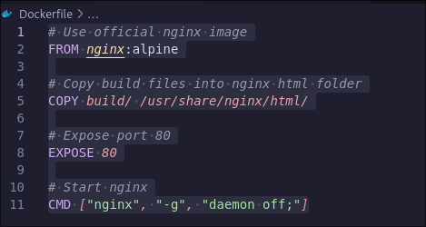

## Step 03

### Create a docker compose file using the above image

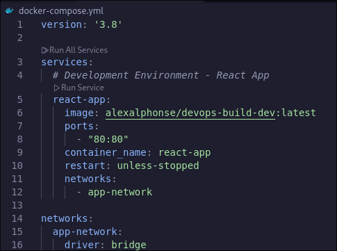

## Step 04

### Write a bash script for building the docker image

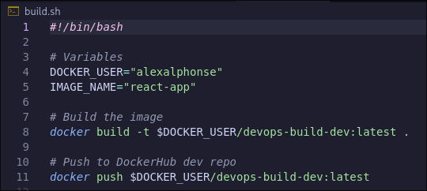

## Step 05

### Write a bash script for deploying the docker image

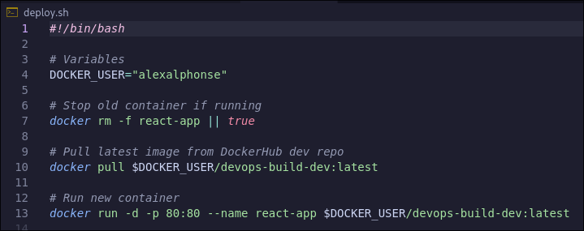

## Step 06

### push the code to github with .dockerignore and .gitinore files

```
git add .

git commit -am "initail commit"

git push origin dev

```

## Step 07

### create two repository in dockerhub "dev" and "prod" to push images

### "prod" repo must be private and dev can be public

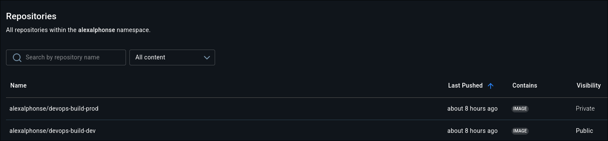

## Step 08

### Install jenkins

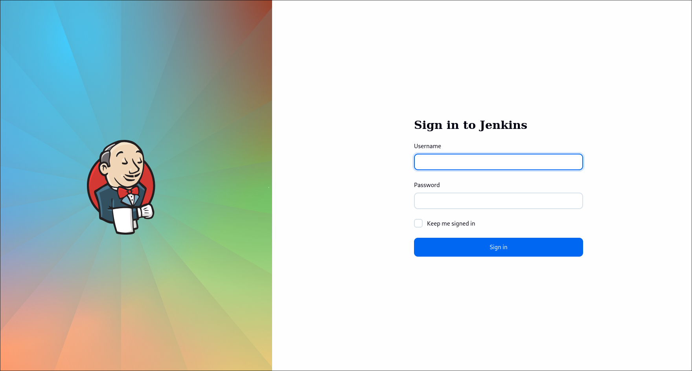


## Step 09

### connect jenkins and github

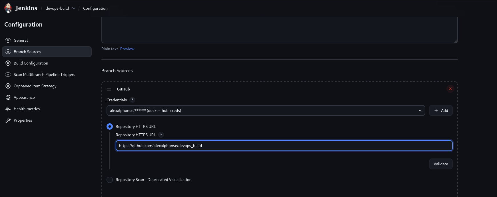

## Step 10

### automate pushed code to dev branch to buld docker image and push to dev repo in dockerhub

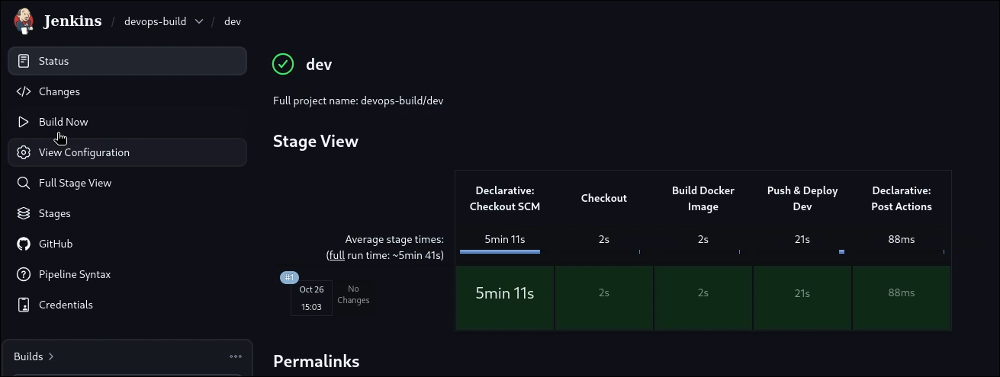
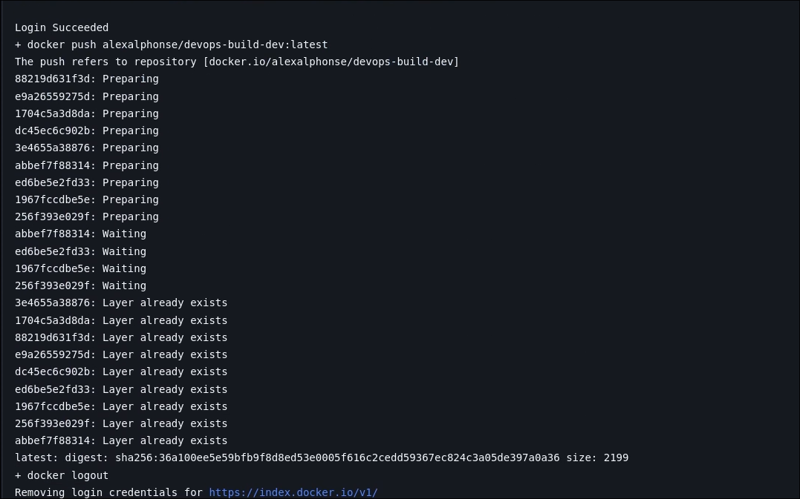

## Step 11

### automate pushed code to prod branch to buld docker image and push to prod repo in dockerhub

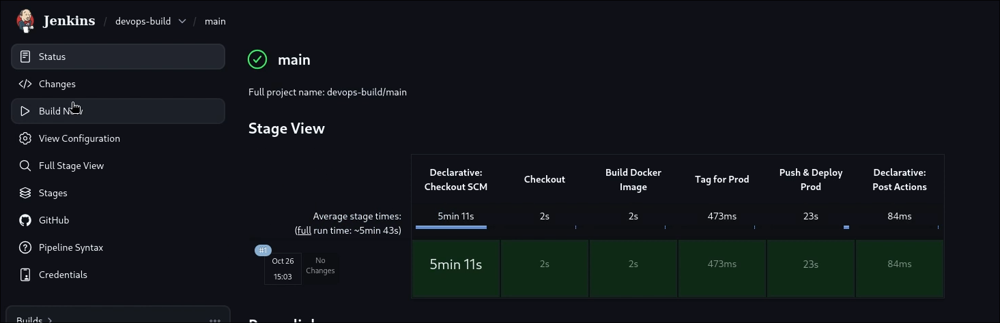
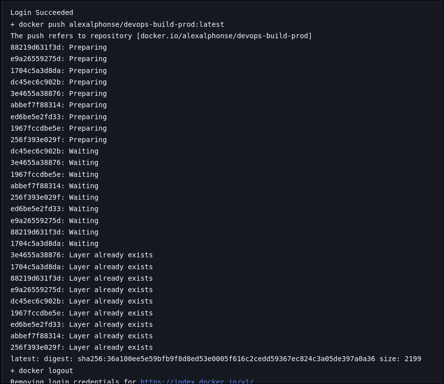

## Step 12

### launch a ec2 instance to deploy the application
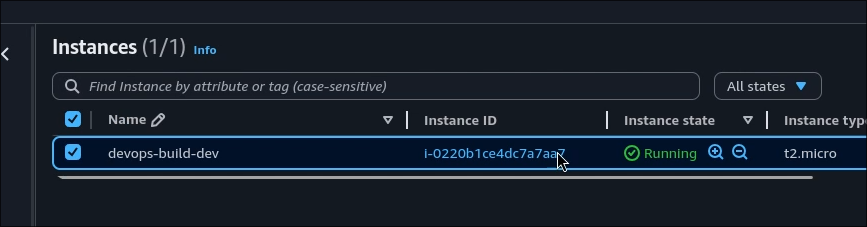

## Step 13

### configure sg group in such a way that everyone can access the application but only i can acces the server
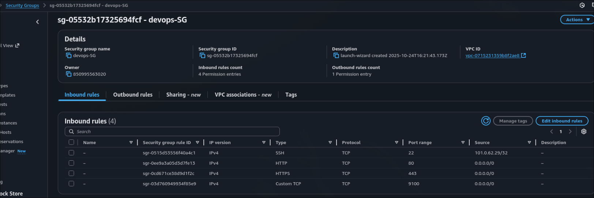

## Step 14

### setup a monitoring stack to monitor the health status
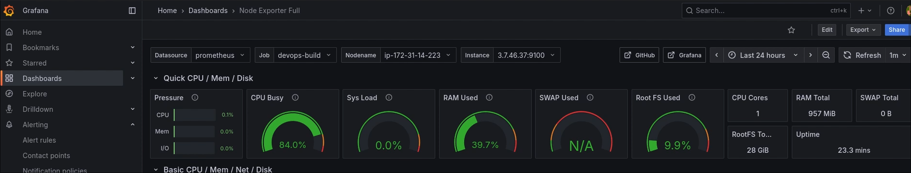

## Step 15

### application output
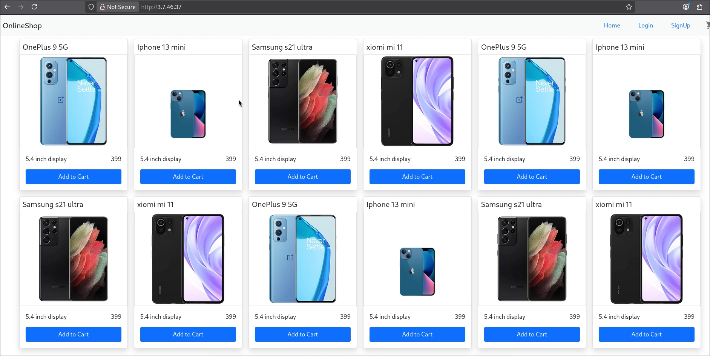

